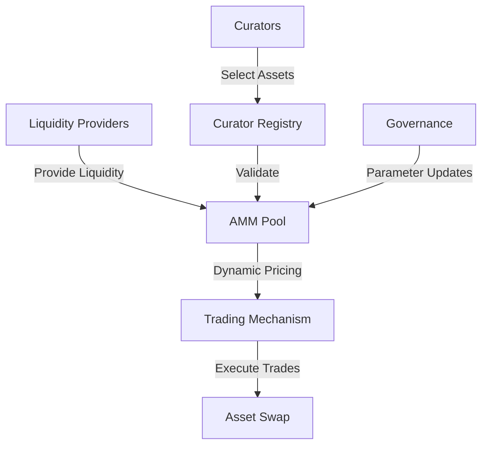

# Peer AMM Curator

A decentralized protocol for curated automated market-making and asset management on the Stacks blockchain.

## Overview

Peer AMM Curator provides a novel decentralized infrastructure for collaborative asset curation, liquidity provisioning, and market-making. It enables:

- Community-driven asset selection and curation
- Decentralized liquidity pools with dynamic parameters
- Transparent and permissionless market-making mechanisms
- Incentive alignment for liquidity providers and curators
- Flexible trading strategies and risk management

## Architecture

The system leverages a modular contract architecture to enable flexible and secure asset management and market-making.



### Core Components
- Curator Registry: Asset validation and curation
- AMM Pool: Liquidity management and trading
- Governance Module: Parameter and protocol upgrades
- Trading Mechanism: Efficient asset swapping

## Contract Documentation

### Curator Registry Contract

The central contract managing asset curation, validation, and market inclusion.

#### Key Features
- Community-driven asset selection
- Reputation-based curation mechanism
- Flexible asset validation rules
- Transparent inclusion/exclusion processes

#### Access Control
- Decentralized curation process
- Reputation-weighted voting
- Transparent governance mechanisms

## Getting Started

### Prerequisites
- Clarinet
- Stacks wallet
- STX tokens for transactions

### Basic Usage

1. **Propose Asset for Curation**
```clarity
(contract-call? .curator-registry propose-asset
    "Asset Symbol"
    "Asset Name"
    u1000000  ;; Initial valuation
    (list "Tag1" "Tag2"))
```

2. **Provide Liquidity**
```clarity
(contract-call? .amm-pool add-liquidity 
    asset-id 
    u10000)  ;; Liquidity amount
```

3. **Vote on Asset Inclusion**
```clarity
(contract-call? .curator-registry vote-on-asset 
    proposed-asset-id 
    true)  ;; Vote in favor
```

## Function Reference

### Public Functions

#### Asset Curation
- `propose-asset`: Submit new asset for consideration
- `vote-on-asset`: Community voting mechanism
- `update-asset-parameters`: Modify asset details

#### Liquidity Management
- `add-liquidity`: Contribute to asset pool
- `remove-liquidity`: Withdraw liquidity
- `rebalance-pool`: Adjust pool parameters

### Read-Only Functions
- `get-asset-curation-status`
- `get-pool-details`
- `calculate-swap-output`

## Development

### Testing
1. Clone the repository
2. Install Clarinet
3. Run tests:
```bash
clarinet test
```

## Security Considerations

### Limitations
- Initial governance model with community constraints
- Gradual decentralization approach
- Dynamic risk management

### Best Practices
- Thorough asset due diligence
- Implement multi-stage validation
- Continuous monitoring of pool dynamics
- Transparent governance processes